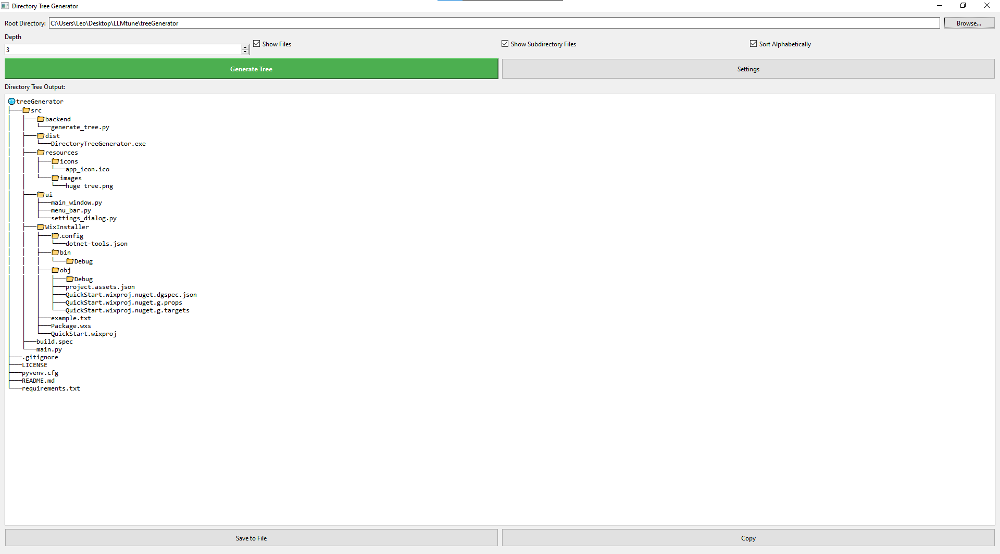

# 🌳 Directory Tree Generator

[](https://github.com/Arthur-001/Directory-Tree-Generator/releases)
[](LICENSE)
[](https://www.python.org/)

A cross-platform tool that generates visual directory structures with customizable filters, exclusions, and export options. Usefule for directory mapping for large scale projects.



## ✨ Features

- **Custom Depth Control**: Specify how many subdirectory levels to display
- **Smart Filtering**:
  - Exclude files/folders by name, pattern, or size
  - Directory-specific inclusion/exclusion rules
- **Multiple Outputs**:
  - Text-based tree diagrams
  - Export to `.txt` files
- **Cross-Platform**: Windows, macOS, and Linux support


## 🚀Future Works
- **Dark/Light Mode**: Adapts to system preferences


## 🛠 Development
- **Requirements**
  - Python 3.8+ (3.13.2 is used here)
  - PySide6

**Setup**
```bash
git clone https://github.com/Arthur-001/Directory-Tree-Generator.git
cd Directory-Tree-Generator
pip install -r requirements.txt
```

**build**
```bash
pyinstaller build.spec
```


## 📥 Installation

### Windows
1. Download the latest `.exe` from [Releases](https://github.com/Arthur-001/Directory-Tree-Generator/releases)
2. Run the installer or portable executable
